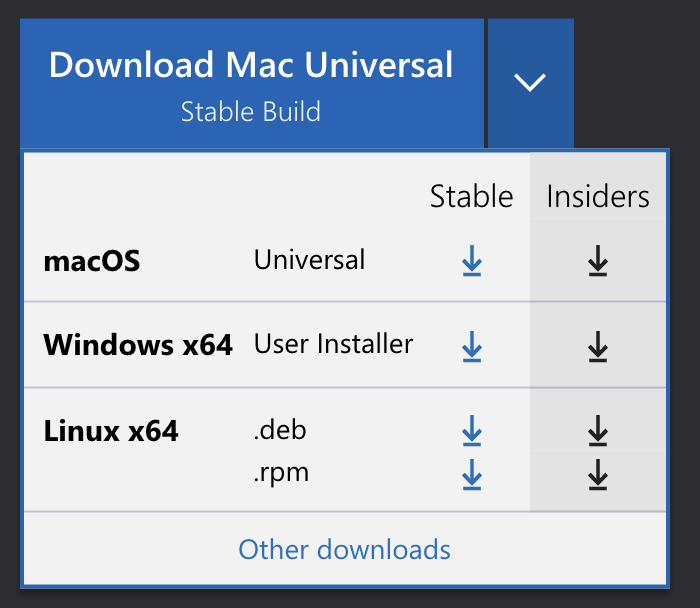
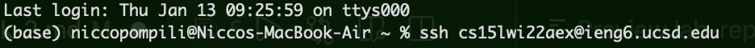
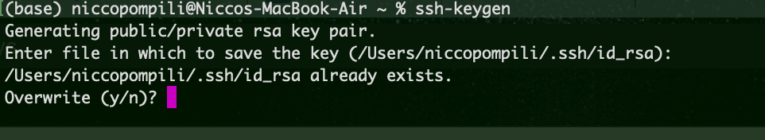
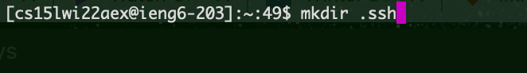
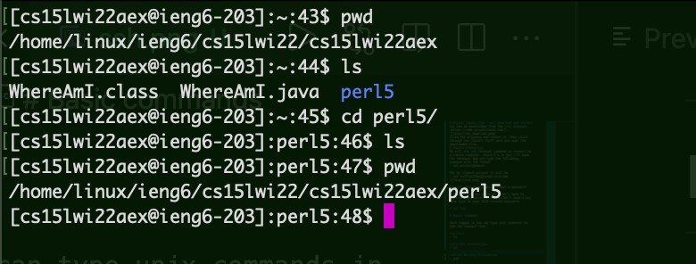
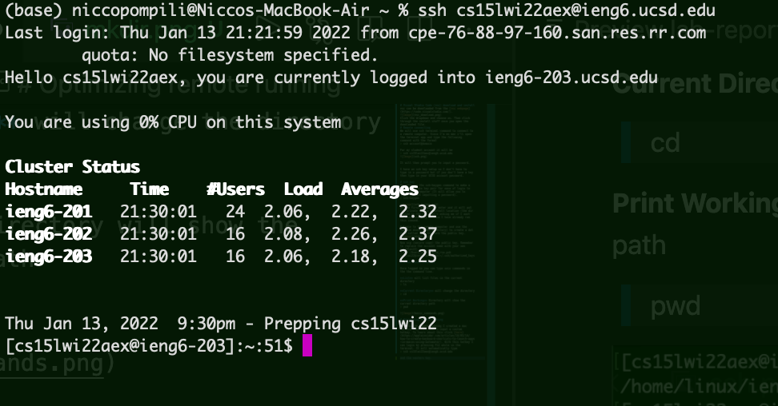

# Visual Studio Code (vsc) download and install
vsc can be downloaded from the [vsc webpage](https://code.visualstudio.com/).

Click the dropdown and choose os. Then click through the install stuff once you open the downloaded file.

***
# Remote connecting
We will use ssh terminal command to connect to a remote computer. Since I'm on mac i'll open the terminal app and type the following command with the format
> ssh account@domain

For my student account it will be
> ssh cs15lwi22aex@ieng6.ucsd.edu

It will then prompt you to input a password.

I have an ssh key setup so I don't have to type in a password but if you don't have a key then type in your UCSD account password.

***
# ssh key
We will use the ssh-keygen command to make a public private key pair for ease of login to the remote computer (It will allow you to login without imputting a password).
> ssh-keygen

At the first prompt hit enter and it will put the private key in a default location (the dir listed in the () ). It's asking me if I want to overwrite only because I have already run this comand.

Relogin to the remote computer and use the command mkdir (make directory) to create a dot file called .ssh to store the public key.

Now scp (secure copy) the public key. Remember to replace the account name with your own (cs15lwi22)
> scp /Users/joe/.ssh/id_rsa.pub cs15lwi22@ieng6.ucsd.edu:~/.ssh/authorized_keys

***
# Other Basic commands

Once logged in you can type unix commands in the the command line. 

**List** will list files in the current directory
> ls

**Current Directory** will change the directory
> cd 

**Print Working** Directory will show the current directory path
> pwd

***
# Optimizing remote running

To optimize remote running I created a mac service that runs when I input a custom hotkey. To learn about this click [here](https://appleinsider.com/articles/18/03/14/how-to-create-keyboard-shortcuts-to-launch-apps-in-macos-using-automator). With this hotkey I can login by pressing F12 while in the terminal. It will automatically type 
> ssh cs15lwi22aex@ieng6.ucsd.edu

and the *enter* key. I can login with one key press.
