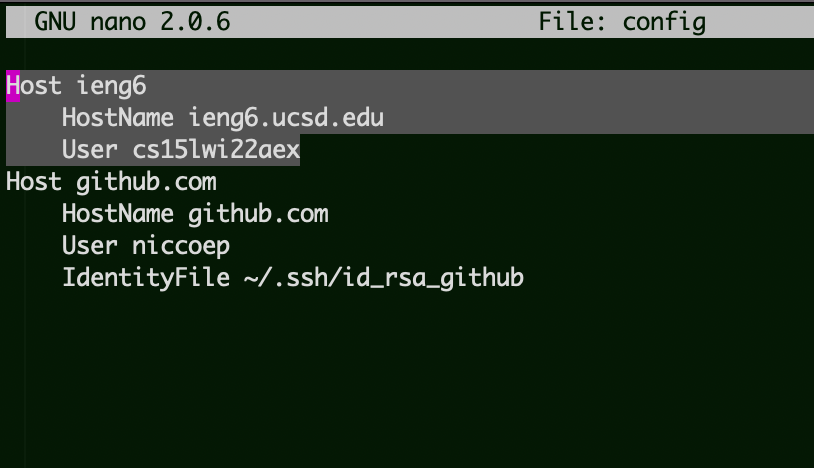
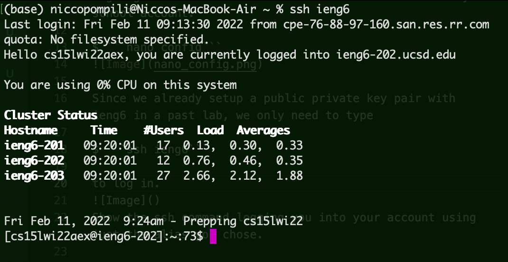
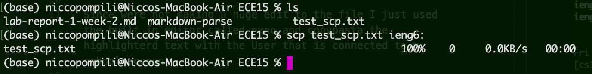
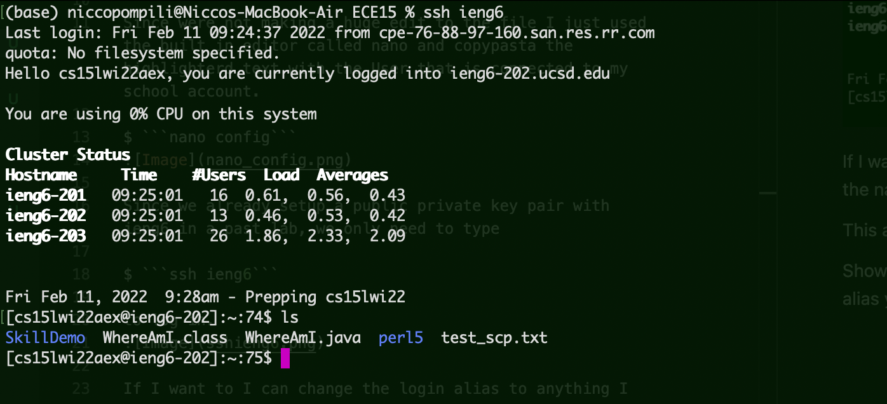

# ***Lab report 3***
***

# Streamlining ssh connection

The config file we need to edit is in the home dir in . file called .ssh

$ ```cd ~/.ssh```


Since were not making a huge edit to the file I just used the built in editor called nano and copypasta the highlighterd text with the User that is connected to my school account.

$ ```nano config```



Since we already setup a public private key pair with ieng6 in a past lab, we only need to type

$ ```ssh ieng6``` 

to log in.



If I want to I can change the login alias to anything I want by changing the name after ```Host``` in the config file.

This also works for ```scp```.





easy peasy 