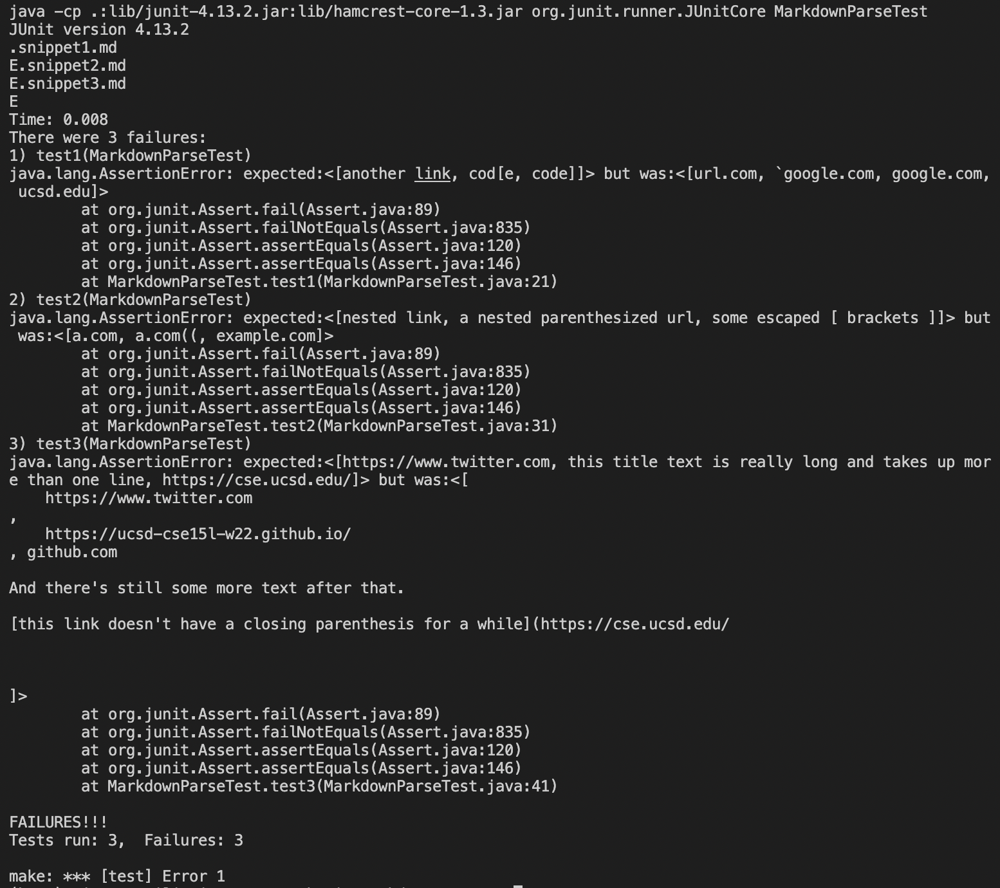
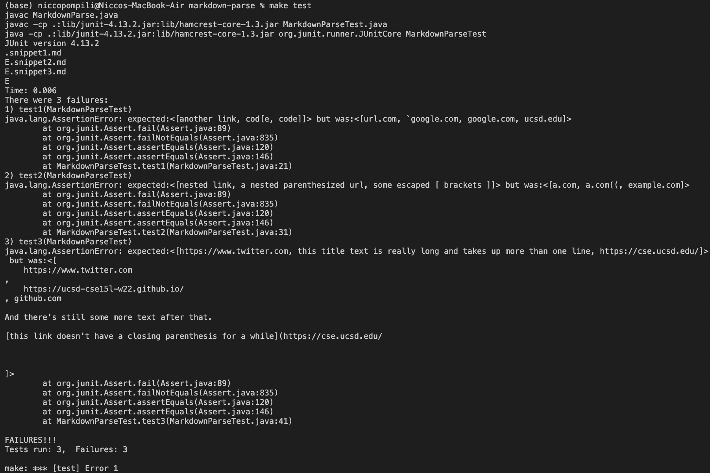

# ***Lab report 4***

MarkdownParse that was reviewed [here](https://github.com/zfxd/markdown-parse.git)

My MarkdownParse [here](https://github.com/niccoep/markdown-parse.git)

# My MarkdownParse

First I looked at what the VSC markdown prievew produced to see what it should produce inorder to make a unit test for the three snippet files.

I put the output that VSC gave into the ecpected List of Strings.

The tests did not pass as my MarkdownParse still does not check for a lot of cases.

# Reviewed MarkdownParse

The same tests were used in the other repo because were testing the same snipped files so the output should be the same if the MarkdownParse program was perfect.

They also all failed.

# Questions

1:
I think It would be <10 line chage to test for code blocks within the link. I would check if the charaters between brackets/in links contain a ` and if so then don't parse that link because it would not be valid.

2: 
I think this might be a little more involved because you there are so many different situations with incorrect brackets. It may be a lot of work to have every case pass.

3:
I think this would be very easy. Just check for a new line character withing the brackets.