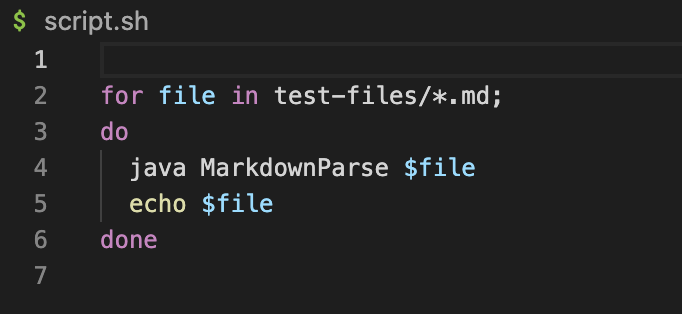
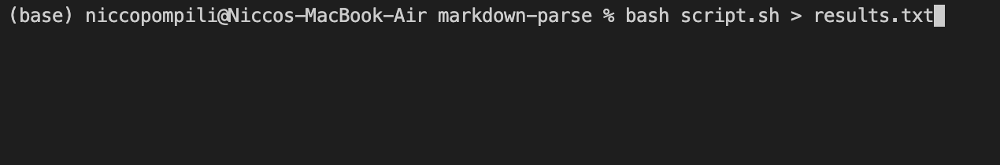

# ***Lab report 5***

For our lab we had the output of our markdownParse for each test file print out to a .txt file. We did the same thing for the provided markdownParse. We then used the diff command to see the differences in the files.

We wrote a script to loop over all the files and run markdownParse on them

Loop for running all .md files:


The command used for runnig the script and outputting to .txt file. This uses output redirection to save the output ot a file.



I also ran the script on the given MarkdownParse and put the output into a seperate text file.

We then ran the diff command on the two files which shows where and what the difference is between the two files. We use this to see where they had differing parsing behaviour.

The output of the diffcomand ```diff results.txt results_final.txt```


```212c212
< []
---
> [url]
230c230
< []
---
> [baz]
270c270
< [/bar\* "ti\*tle"]
---
> []
492c492
< [/f&ouml;&ouml; "f&ouml;&ouml;"]
---
> []
692c692
< [url &quot;tit&quot;]
---
> []
850c850
< [/uri "title"]
---
> []
862c862
< [/my uri]
---
> []
864c864
< [</my uri>]
---
> []
878c878
< [\(foo\]
---
> [\(foo\)]
880c880
< [foo(and(bar]
---
> [foo(and(bar))]
882c882
< [foo(and(bar]
---
> []
884c884
< [foo\(and\(bar\]
---
> []
886c886
< [<foo(and(bar]
---
> []
902c902
< [/url "title", /url 'title', /url (title]
---
> []
904c904
< [/url "title \"&quot;"]
---
> []
908c908
< [/url "title "and" title"]
---
> []
910c910
< [/url 'title "and" title']
---
> []
916c916
< []
---
> [/uri]
918c918
< []
---
> [/uri]
920c920
< []
---
> [/uri]
934c934
< []
---
> [uri1]
1040c1040
< [not a link]
---
> []
1054c1054
< []
---
> [/url]
1056c1056
< []
---
> [/url]
1062c1062
< []
---
> [train.jpg]
1066c1066
< []
---
> [<url>]
1070c1070
< []
---
> [/url]
```

Taking the case for line 1040 on both files, we can see that our implimentation printed out ```[not a link]``` when the given implementation printed ```[]```

This corisponds to ```test-files/567.md```.
Puting the contents of this into an online parser 
we see that a link does infact apper. ```(not a link)``` also appears but as text. My implimentation is incorrect. It should not have the link address as ```not a link```. 

The symptom is caused by a lack of checkng for spaces. The link should not be included if it contains spaced.

An fix is to check for spaces in the link address. To mimic the online parser we would also have to turn the contents before the next closing bracket to text.

***
Another case is line 850 on both files. we can see that our implementatioin resulted in ```[/uri "title"]``` where the given markdownParse did not provide a link.

This corisponds to ```test-files/567.md```. Checking the online parser again we see that there should be a link. There is a problem though. Our link contains ```/uri "title"``` where the parser contains ```/uri```. 

In the provided MarkdownParse the link is completley dropped when it shuld still provide a link. 
```
if(potentialLink.indexOf(" ") == -1 && potentialLink.indexOf("\n") == -1) {
```
because of the line shown above in the provided MarkdownParse, the link is not added to the arraylist if there is a space before the ending bracket.